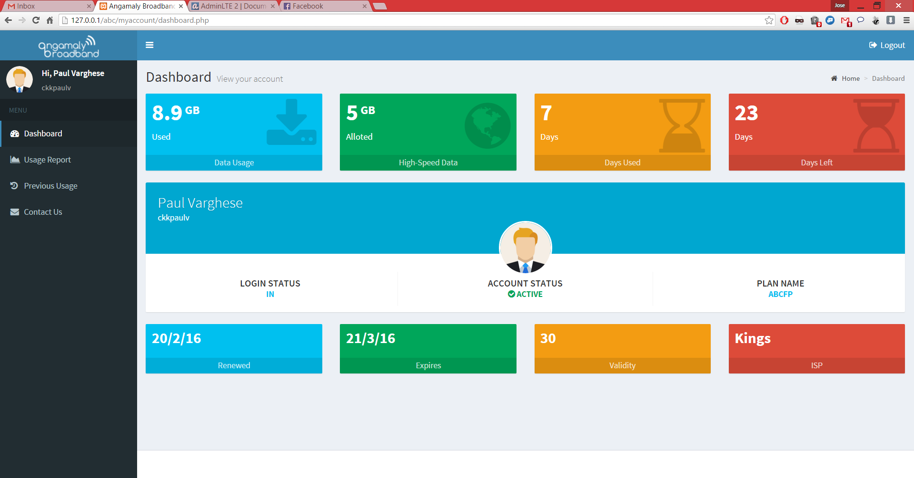

# Broadband user dashboard PHP

## About
> This was a hobby project which **I completed in 2016**

My ISP was using a subscriber management software which had a user dashboard that looked old school and unresponsive. I wanted to make the dashboard look cool and responsive. As the subscriber management software didn't provide a API, I used PHP cURL to submit my login id and password to the original dashboard URL, retrieve my dashboard data, convert it to JSON and display it in a responsive HTML theme (AdminLTE). The ISP moved to a different subscriber management software and this project is reduntant for my ISP  but might work with other ISP's using the same subscriber management software version by changing the host URL in the PHP files. 

## Screenshot

 

## Credits

[Stackoverflow](https://stackoverflow.com/questions/25794778/why-php-curl-doesnt-keep-the-cookie-data-for-the-session)

[AdminLTE by Abdullah Almsaeed](https://adminlte.io/)
